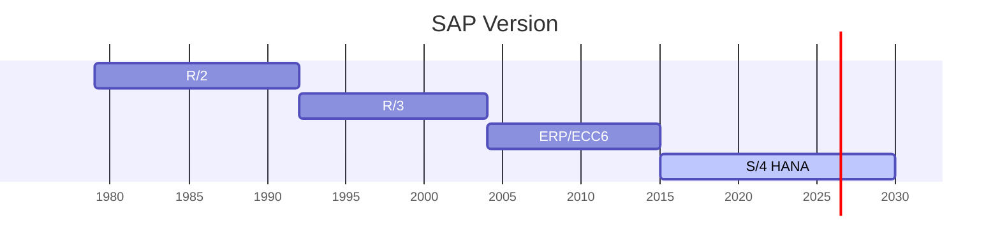

# SAP Learning
Tag : sap

---

## 概要

  SAP，为“System Applications and Products”的简称，是SAP公司的产品——企业管理解决方案的软件名称。
  SAP公司（纽交所代码：SAP）成立于1972年。

  总部位于德国沃尔多夫市，在全球拥有6万多名员工，遍布全球130个国家，并拥有覆盖全球11,500家企业的合作伙伴网络。

---

## 版本介绍

> SAP Business One—面向中小型企业

    SAP Business One（简称SAP B1）是一款可随企业发展而扩展的中小型企业管理软件，能够协助中小型企业加强自身管控。

    通过SAP B1企业可以简化财务运营流程，有效管理销售从接触客户到签订订单、售后支持的整个流程，跟踪服务客户全生命周期。
    SAP B1能够优化采购流程，精细化把控成本。同时，SAP B1具有智能分析与报告功能，为企业决策提供了准确、及时的数据信息。

> SAP Business ByDesign—面向快速成长型企业

    SAP Business ByDesign（简称SAP BYD）是一款适合成长型企业的智能ERP云，能够简化端到端的流程，灵活性高，有助于企业及时把握新机遇。
    
    通过SAP BYD能够实时了解企业财务状况，科学管理资金流动。同时SAP BYD能够深入优化供应链管理，简化与客户和供应商的协作，有效整合价值链，
    提高成本透明度。SAP BYD提供本地实践规范构建及多语言翻译工具，适应企业本地化需求。

> SAP S/4 HANA—集成式智能ERP系统

    全称: SAP Business Suite 4 SAP HANA
    SAP S/4HANA基于先进智能技术，进一步革新业务流程，快速部署实现智能数字化转型。
    
    SAP S/4HANA能够协助企业实现财务业务一体化，完善生产计划流程，加强质量监管，有效优化产品生命周期管理，创新企业研发活力。
    SAP S/4HANA支持定制行业特需功能，满足企业个性化需要。通过SAP S/4HANA，企业可以减少10倍的数据量，简化4倍的流程步骤，提高30％的生产效率。

---

## 版本变迁

